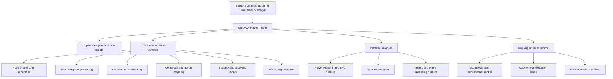

# Architecture

## Summary

This repository currently has a hybrid architecture:

1. `clippyagent` is the mature local runtime layer.
2. `clippybot` is the expanding platform-acceleration layer for Copilot, Copilot Studio, Power Platform, Teams, Dynamics, and Microsoft 365 scenarios.

That split matters. The local runtime is the most proven execution surface in the repo today. The Microsoft platform work is real and growing, but much of it is still best understood as scaffolding, orchestration, adapters, and onboarding support rather than a fully demonstrated hosted runtime.

## Architecture diagram

## Layer responsibilities

### 1. Local runtime layer: `clippyagent`

Primary role:

- local agent execution
- tool invocation and environment control
- autonomous software-engineering style workflows

This is the part of the repo that most clearly matches a working runtime today.

### 2. Platform layer: `clippybot`

Primary role:

- wrap Copilot-oriented clients and agents
- help plan and scaffold Copilot Studio solutions
- provide adapters for Power Platform, Dataverse, Teams, and related Microsoft 365 surfaces
- support onboarding experiences for planner, designer, researcher, and analyst style work

This layer reflects the intended product direction, but it should be described as an augmentation and acceleration layer, not a fully proven hosted runtime.

## What is implemented today

- local runtime foundations in `clippyagent`
- Copilot client and agent wrappers in `clippybot`
- Copilot Studio builder swarm components, including planning, scaffolding, ingestion, actions, security, publishing, and analytics stages
- helper modules for Teams, Dataverse, Power Platform CLI, adaptive cards, and flow definitions

## What should not be overstated

The repository does not yet prove:

- full hosted Copilot Studio runtime completeness
- uniform production readiness across all Microsoft channels
- finished end-to-end experiences for every planner, designer, researcher, and analyst workflow

The most accurate description is:

"A mature local agent runtime plus an expanding Microsoft platform augmentation layer."

## Direction of travel

The intended direction is to help teams move from idea to working business-agent assets across:

- Power Platform
- Dynamics 365
- Copilot Studio
- Teams
- Microsoft 365

That includes stronger onboarding and acceleration for:

- planners turning requirements into agent specs
- designers shaping flows, actions, and channel experiences
- researchers grounding agents with knowledge sources and discovery inputs
- analysts reviewing telemetry, quality, governance, and rollout readiness

## Boundary guidance

Use `clippyagent` messaging when discussing:

- mature local execution
- autonomous task loops
- tool-using agent runtime behavior

Use `clippybot` messaging when discussing:

- Copilot and Copilot Studio acceleration
- Power Platform and Dataverse adapters
- Teams and M365 publishing workflows
- planner / designer / researcher / analyst onboarding support

Avoid collapsing those two layers into a single claim of end-to-end platform completeness.
