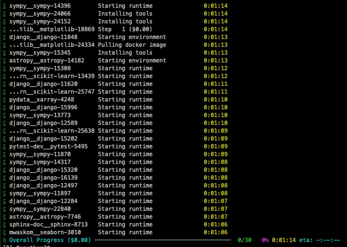

# Batch mode

!!! abstract "Running on many issues at once"
    You have used `clippybot run`. To become a real power user, we'll convert you to `clippybot run-batch` and you can run on a hundred issues at once.

    * Please make sure you're familiar with [the command line basics](cl_tutorial.md).
    * The default examples will be executing code in a Docker sandbox, so make sure you have docker installed ([docker troubleshooting](../installation/tips.md)).
      If you cannot run docker, skim through the examples below and adapt accordingly.

## A first example: clippybot-bench

So you've decided to run clippybot on a lot of issues in parallel. Great, the `run-batch` command is exactly here for that.
Let's run on three [clippybot-bench](https://www.clippybotbench.com/) issues which will be downloaded automatically.

```bash
clippybot run-batch \
    --config config/default.yaml \
    --agent.model.name gpt-4o \
    --agent.model.per_instance_cost_limit 2.00 \
    --instances.type clippybot_bench \
    --instances.subset lite \
    --instances.split dev  \
    --instances.slice :3 \
    --instances.shuffle=True
```

Let's look at the options:

1. `--instances.type clippybot_bench`: There's a couple of built-in ways to configure instances. This option selects the clippybot-bench dataset.
2. `--instances.subset lite`: There's a few datasets provided by the clippybot-bench project. Lite is a subset of GitHub issues with a few heuristic filters that makes them more likely to be solvable.
3. `--instances.split dev`: Most datasets have a `dev` and a `test` split.
4. `--instances.slice :3`: The `--slice` option allows you to select a subset of instances from the dataset. It works just the way to pythons `list[...]` slicing, so you can specify `:10` to take the first 10 instances, `10:20` to take the next 10, `-10:` to take the last 10, or `10:20:2` to take every second instance in that range.
5. `--instances.shuffle=True`: Shuffle all instances before slicing. This is a deterministic operation, so the same command will always return the same instances in the same order.

* There's some things that you should recognize: All of the `--agent` options are available and you can still specify `--config` files.
* However, the `--problem_statement`, `--repo`, and `--env` options obviously need to change, because you now want to populate these settings automatically from a source.

This is where the new option comes in: `--instances`, specifying the **instance source** together with a few options.

!!! tip "Tooltips"
    Click on the :material-chevron-right-circle: icon in the right margin of the code snippet to see more information about the line.

The output should remind you a lot like the output of the [hello world tutorial](hello_world.md), except for the progress bar at the bottom.
Kind of slow, isn't it?


!!! tip "All command line options"
    * See [`RunBatchConfig`](../reference/run_batch_config.md#clippybot.run.run_batch.RunBatchConfig) for an overview of all options.
    * clippybot-bench config: [`clippybotbenchInstances`](../reference/batch_instances.md#clippybot.run.batch_instances.clippybotbenchInstances).

!!! tip "Evaluating on clippybot-bench"
    If you are using [`sb-cli`](https://www.clippybotbench.com/sb-cli/), you can automatically evaluate on clippybot-bench by adding the `--evaluate=True` flag.
    This will already submit submissions to `sb-cli` while you are running, so that you should receive results within a minute of finishing your run.

## Multimodal clippybot-bench

clippybot supports the **clippybot-bench Multimodal** dataset, which includes GitHub issues with associated images (screenshots, diagrams, UI mockups). To run on multimodal instances:

```bash
clippybot run-batch \
    --config config/default_mm_with_images.yaml \
    --agent.model.name claude-sonnet-4-20250514 \
    --agent.model.per_instance_cost_limit 2.00 \
    --instances.type clippybot_bench \
    --instances.subset multimodal \
    --instances.split dev  \
    --instances.slice :3 \
    --instances.shuffle=True
```

Key differences for multimodal runs:

- **Configuration**: Use `config/default_mm_with_images.yaml` which includes image processing capabilities
- **Subset**: Use `--instances.subset multimodal` to access the multimodal dataset
- **Token limits**: Consider higher cost limits as images consume more tokens
- **Multimodal Tools**: `tools/image_tools` and `tools/web_browser` include useful tools for viewing images and web browsers

The system automatically:
- Downloads images from GitHub issue URLs
- Converts them to base64 markdown format
- Provides visual context to the AI model

!!! tip "Multimodal Configuration"
    See the [multimodal guide](multimodal.md) for detailed configuration options and troubleshooting.

## Running in parallel

Let's speed things up and run on 5 instances at once. Only a single line to change:

```bash hl_lines="4-4"
clippybot run-batch \
    --config config/default.yaml \
    --agent.model.name gpt-4o \
    --num_workers 3 \
    --agent.model.per_instance_cost_limit 2.00 \
    --instances.type clippybot_bench \
    --instances.subset lite \
    --instances.split dev  \
    --instances.slice :3 \
    --instances.shuffle=True
```

You'll see output that looks like this (only with 3 workers instead of 30):

<figure markdown="span">
{: style="max-width: 500px; border-radius: 10px;"}
<figcaption>clippybot running on 30 clippybot-bench instances</figcaption>
</figure>

!!! tip "All command line options"
    See [`RunBatchConfig`](../reference/run_batch_config.md#clippybot.run.run_batch.RunBatchConfig) for an overview of all options.

When starting a lot of parallel instances with the docker backend, it might happen that you see some bottleneck effects
(e.g., when running on a platform with few CPUs, you might see some timeouts because there's not enough CPUs to handle the startup of all containers in time).
In this case, please set `--random_delay_multiplier` to e.g., 1. This means that every worker will wait a random time between `0s` and `1s * #workers` before starting,
thereby easing CPU pressure. Default is 0.3.

## Loading instances from a file

```bash
clippybot run-batch \
    --config config/default.yaml \
    --agent.model.name gpt-4o \
    --instances.type file \
    --instances.path instances.yaml \
    --instances.slice :3 \
    --instances.shuffle=True
```

`--instances.path` supports `.jsonl`, `.json`, and `.yaml` files.

Here'the simplest example of what such a file can look like

```yaml title="instances.yaml"
- image_name: "python:3.11"  # (1)!
  problem_statement: "A simple test problem"
  instance_id: "simple_test_problem"
- image_name: "python:3.11"
  problem_statement: "Another test problem"
  instance_id: "simple_test_problem_2"
```

1. Must be available locally or on dockerhub.

!!! warning "Recent changes"
    The `instance_id` key was named `id` until Mar 16, 2025.
    This was changed to add compatibility with the standard clippybot-bench format.
    However, we temporarily support both names.

!!! tip "More options"
    * There's a few more fields that you can populate. See [`SimpleBatchInstances`](../reference/batch_instances.md#clippybot.run.batch_instances.SimpleBatchInstance) for more information.
    * For all command line options with this instance type, see [`InstancesFromFile`](../reference/batch_instances.md#clippybot.run.batch_instances.InstancesFromFile).

## Huggingface instances

If you upload your dataset to Huggingface in a similar style as the example we just saw, you can load it like this:

```bash
clippybot run-batch \
    ...
    --instances.type huggingface \
    --instances.dataset_name "your_username/your_dataset" \
    --instances.split "dev" \
    --instances.slice :3 \
    --instances.shuffle=True
```

!!! tip "All instance options"
    See [`InstancesFromHuggingFace`](../reference/batch_instances.md#clippybot.run.batch_instances.InstancesFromHuggingFace).

## Expert instances

If this is not enough for your use case, you can also specify a full set of `Environment`, `ProblemStatement`, and `Repository` config objects:

```bash
clippybot run-batch \
    ...
    --instances.type expert_file \
    --instances.path instances.yaml
```

where `instances.yaml` could look like this:

```yaml title="instances.yaml"
- env:
    deployment:
      type: docker
      image: python:3.11
    repo:
        type: github
        github_url: "https://github.com/clippybot/test-repo"
  problem_statement:
    type: text
    text: "A simple test problem"
    id: "simple_test_problem"
- env:
    deployment:
      type: docker
      image: python:3.11
  problem_statement:
    type: text
    text: "A simple test problem 2"
    id: "simple_test_problem_2"
```

!!! tip "All instance options"
    See [`ExpertInstances`](../reference/batch_instances.md#clippybot.run.batch_instances.ExpertInstancesFromFile).

## Output files and next steps

All patches generated (all submissions/predictions of the agent) are saved to a `preds.json` file.
If you interrupt `clippybot run-batch`, some of these or the file itself might be missing.
You can use the `clippybot merge-preds` utility to fix this.

The `preds.json` file is very similar to the `.jsonl` format that is used for clippybot-bench local runs.
You can convert between the formats with

```python
from pathlib import Path
import json

preds = json.loads(Path("preds.json").read_text())
data = [{"instance_id": key, **value} for key, value in preds.items()]
jsonl = [json.dumps(d) for d in data]
Path("all_preds.jsonl").write_text("\\n".join(jsonl))
```

!!! tip "Next up"

    Take a look at our [competitive runs tutorial](competitive_runs.md)
    for more information on running on clippybot-bench and similar benchmarks.
